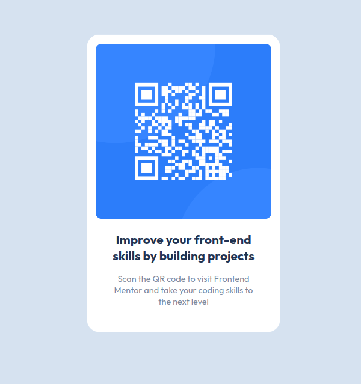

# Frontend Mentor - QR code component solution

This is a solution to the [QR code component challenge on Frontend Mentor](https://www.frontendmentor.io/challenges/qr-code-component-iux_sIO_H). Frontend Mentor challenges help you improve your coding skills by building realistic projects.

## Table of contents

- [Overview](#overview)
  - [Screenshot](#screenshot)
  - [Links](#links)
- [My process](#my-process)
  - [Built with](#built-with)
- [Author](#author)

## Overview

### Screenshot

### Links

- Solution URL: [Front End Mentor](https://www.frontendmentor.io/solutions/responsive-qr-card-component-S5E2YthHuc)
- Live Site URL: [Live Site URL](https://abdallarahmah.github.io/QR-code-component/)

## My process

### Built with

- HTML
- CSS custom properties
- Flexbox
- Mobile-first workflow

## Author

- Frontend Mentor - [@AbdallaRahmah](https://www.frontendmentor.io/profile/AbdallaRahmah)
- Twitter - [@Abdalla_Rahmah](https://twitter.com/abdalla_Rahmah)
